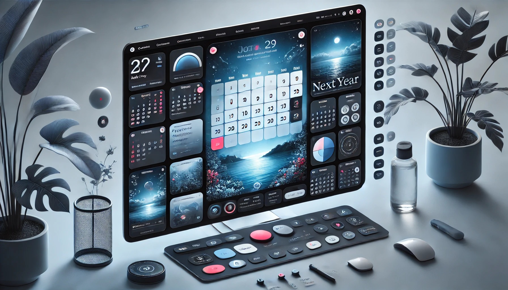

✨ Interactive Calendar 🗓️

Overwhelmed by your schedule? 😫 Reclaim your time with the Interactive Calendar!
Effortless event management, cross-device access, and calming themes like "Ocean View" make scheduling a breeze.

🗓️✨ The Interactive Calendar is here to simplify your life. This modern web application combines intuitive design with powerful features to help you stay organized, no matter where you are.

Effortlessly organize your tasks, events, and reminders with the Interactive Calendar—a modern, feature-rich application designed to make scheduling stress-free and enjoyable!

Whether you’re managing work deadlines, personal appointments, or everything in between, this intuitive calendar ensures you stay on top of your schedule, anytime and anywhere.

🚀 Say Goodbye to Calendar Chaos!

👋 Introducing My Updated Interactive Calendar 🗓️

Feeling overwhelmed by your schedule? I get it. That's why I've been working hard to revamp my interactive calendar, and I'm excited to share the latest version with you! 🎉
This isn't just another calendar. It's designed to make staying organized a breeze, whether you're juggling work deadlines, personal appointments, or everything in between.

🚀 What’s New?

⏰ Analog Clock Functionality

Implemented a real-time analog clock using JavaScript, HTML, and CSS.
Features smooth second, minute, and hour hand movements.
Uses setInterval to update the clock every second for accurate timekeeping.
Responsive design ensures proper display across different screen sizes.
Styled with CSS for a clean and visually appealing clock face.
The clock automatically starts displaying the current system time upon loading.

📅 Additional Features

🔄 Dynamic Year Navigation: Easily switch between years using "Previous Year" and "Next Year" buttons. The current year is always in red color.

📱 Works on Any Device: From your desktop to your phone, the responsive design ensures a seamless experience.

📝 Effortless Event Management: Adding, editing, and viewing events is now a snap – just click on any date!

❌ Event Clearing: Remove all events for a specific date or clear the entire calendar effortlessly.

📅 Super Smooth Navigation: Jump between years effortlessly with intuitive controls. Plus, "Today's Highlight" keeps you grounded: the current date is automatically highlighted for quick reference.

💾 Local Storage: Events are saved locally in the browser and persist between page refreshes.

♿ Built for Everyone: Accessibility is a priority, with WCAG-compliant styles and high contrast for optimal usability. ♿

🌙 Dark Mode: Toggle between light and dark modes for a more personalized viewing experience, and your preference is saved across sessions.

🔝 Back to Top Button: Easily scroll back to the top of the calendar with a smooth click.

Stay on top of your schedule with ease! 🚀

🎨 Multiple Themes for Your Calendar 📅

Personalize your planning experience with an array of beautifully crafted themes:

Light Mode ☀️: Bright and crisp for your daytime productivity.

Dark Mode 🌙: Perfect for late-night planning, easy on the eyes.

Ocean View 🌊: Immerse yourself in tranquility with a theme inspired by the sea.

Greyscale 🖤: Sleek and minimalist for a modern aesthetic.

Serene Shores 💙: A calming theme inspired by serene shorelines, featuring a cool blue palette and gentle wave-like patterns.

Autumn Harvest 🍂: Embrace the cozy vibes of fall with warm tones, earthy textures, and touches of orange, red, and golden leaves.

Blue Ice ❄️: Crisp and cool, evoking the calmness of winter.

Deep Forest 🌲: Immerse yourself in a rich, earthy forest theme with deep greens and natural textures.

Cherry Garden 🌸: A fresh, vibrant theme inspired by the beauty of cherry blossoms in full bloom.

Orange Country 🍊: A bright and energetic theme inspired by sun-kissed orchards, featuring bold orange hues and a warm, cheerful ambiance.

Neon Nights 🌟: A vibrant, high-energy theme with bold neon colors that glow against a dark background, perfect for creating an electrifying vibe.

Desert Mirage 🏜️: A warm, sunlit theme inspired by the vast desert landscapes, featuring sandy beige, golden brown, and deep terracotta hues that evoke a sense of adventure and tranquility.

Lavender Bliss 💜: A soothing, delicate theme with soft lavender tones and calming accents, designed to bring a sense of peace and relaxation.

Spring Meadow 🍃: A fresh and lively theme inspired by blooming meadows, featuring soft greens, pastel florals, and the gentle warmth of spring sunshine.

Galactic Glow ✨: A cosmic theme with vibrant purples, blues, and glowing stars.🚀🌌

Golden Horizon 🌅: A radiant and uplifting theme with golden hues, warm gradients, and a horizon-inspired aesthetic that brings a sense of optimism and energy.

Northern Nights ❄️🌌: A mystical and captivating theme inspired by the beauty of the Northern Lights, featuring deep blues, shimmering purples, and a touch of icy brilliance.

Arctic Glow 🧊: A frosty theme inspired by icebergs and glaciers, with crisp whites, icy blues, and translucent effects.

New AI Theme 🤖: A modern, sleek theme featuring deep blues, soft grays, and vibrant orange accents, perfect for a high-tech, innovative look.

Steel Shadows 🏗️: A bold, industrial theme with sleek steel grays, shadowy undertones, and a refined metallic finish, evoking strength, precision, and modern sophistication.

Tropical Sunset 🌴🌅: A vibrant, exotic theme with warm pinks, deep purples, and golden oranges, capturing the breathtaking beauty of a beachside sunset.

Exotic Island 🏝️: A tropical paradise theme with lush greenery, crystal-clear waters, and warm sandy tones, transporting you to a relaxing island escape.

Pink Lake 🌷: A soft and tranquil theme inspired by the stunning beauty of pink lakes, featuring delicate pastel pinks and calm reflections for a peaceful, serene ambiance.Exotic Island

Crystal Snowfall ❄️: A pristine winter wonderland theme featuring soft whites, sparkling blues, and frosty textures that evoke the magic of falling snowflakes.

Sky Eagle 🦅: A majestic theme inspired by the vast skies, with deep blues and soaring whites, capturing the freedom and power of an eagle in flight.

Monochrome Ink 🖋️: A sleek, black-and-white design with ink-brush accents for a timeless look, perfect for those who appreciate minimalist elegance with a creative flair.

Purple Fog 🌫️: A dreamy, ethereal theme with soft purple hues and misty gradients, evoking a calm, mysterious atmosphere perfect for creative inspiration and quiet reflection.

Amazon Dolphin 🐬: A vibrant, nature-inspired theme featuring lush green jungles, clear blue waters, and the playful essence of dolphins swimming freely in the Amazon River, perfect for an exotic, fresh look.

Stockholm Roofs 🏙️: A modern, urban theme inspired by the beautiful rooftops of Stockholm, featuring sleek, architectural designs, a blend of contemporary and classic tones, and a Scandinavian touch.

Mountain Peak 🏔️: A rugged, adventurous theme inspired by towering mountain landscapes, featuring earthy tones, cool blues, and majestic, snow-capped peaks, evoking a sense of strength, tranquility, and the thrill of reaching new heights.

Secretive Ninja 🥷: A sleek and stealthy theme with deep, shadowy hues, mysterious accents, and a refined aesthetic inspired by the art of the ninja. Perfect for those who appreciate a balance of secrecy, elegance, and focus.

Black Hacker 🕶️: A bold and enigmatic theme with deep blacks, neon highlights, and cyberpunk aesthetics, inspired by the underground world of ethical hacking and digital intrigue. Perfect for those who love a sleek, high-tech vibe.

Cyber Pulse ⚡: A futuristic, electrifying theme with pulsating neon blues, cybernetic accents, and sleek digital aesthetics. Perfect for those who love a high-tech, energetic, and immersive digital experience.

Dragon Flame 🔥: A fiery and intense theme with vibrant oranges, reds, and yellows, evoking the power and beauty of dragon fire. Perfect for those who want a bold, passionate, and energetic look.

Solar Flare 🌞: A dynamic and energetic theme inspired by the power of solar flares. Featuring bright golden-orange hues and radiant light effects, it creates an atmosphere of warmth, strength, and boundless energy.

Pure Light ✨: A pristine, luminous theme that combines soft whites, delicate pastels, and subtle gradients for a clean, refreshing aesthetic, designed to create a sense of clarity and inspiration.

Shaolin Monastery 🏯: A serene and earthy theme inspired by the tranquility and discipline of Shaolin monks. 
Featuring natural beige tones, deep browns, and subtle textures, this theme brings a sense of calm, focus, and connection to nature. Perfect for those seeking balance and mindfulness in their daily planning.

Black Coffee ☕: A rich, warm theme inspired by the deep, earthy tones of freshly brewed coffee. Featuring dark browns, creamy beiges, and warm copper accents, this theme is perfect for creating a cozy, inviting atmosphere.

Forgotten Dreams 💭: A nostalgic and ethereal theme with soft, muted tones, evoking a sense of wistful remembrance and peaceful contemplation.

Wild Wonders 🌿: Earthy tones and playful accents.

Candy World 🍬🍭: A sweet and playful theme with vibrant pastel colors, candy-inspired icons, and a whimsical design that evokes the joy and fun of a candy wonderland.

Cracked Ice 🧊: A cool, icy theme with crisp whites, icy blues, and translucent effects, evoking the calmness of winter.

Fir Balsam 🌲: A fresh and invigorating theme inspired by the scent of balsam fir trees, featuring deep greens, rich browns, and a touch of pinewood texture, bringing the essence of a peaceful forest retreat.

Sea Diamonds 💎🌊: A mesmerizing oceanic theme with deep sapphire blues, shimmering silvers, and crystal-clear aqua tones, evoking the beauty and mystery of the sea’s hidden treasures.

Antarctic Snowdrifts ❄️: A crisp and cool theme inspired by the serene beauty of Antarctic landscapes, featuring a palette of icy blues, soft whites, and subtle gradients that evoke the calmness and tranquility of a snowy winter wonderland.

Silicon Valley 💻: A sleek and modern theme inspired by the cutting-edge tech hub, featuring clean lines, a 
minimalist design, and a palette of cool grays, electric blues, and subtle neon accents, reflecting the innovative spirit of Silicon Valley.

Time Machine ⏳: A theme that evokes a sense of nostalgia and adventure, with vintage tones and clock-inspired design elements.

Magellanic Penguin 🐧: A chilly, yet charming theme inspired by the Antarctic penguin species, featuring icy blues and snowy whites.

White Shark 🦈: A bold, sleek theme inspired by the great white shark, with a dynamic design featuring shades of white and deep ocean blues.

Blue Whale 🐋: A calming, deep-sea inspired theme with shades of blue and soft gradients, capturing the majestic nature of the blue whale.

Polar Bear 🐻‍❄️: A frosty, winter-inspired theme with soft whites, cool blues, and subtle textures that evoke the Arctic home of the polar bear.

Mountain Lake 🏞️: A serene and peaceful theme with rich blues and earthy greens, inspired by the beauty of mountain lakes.

Pirate Ship 🏴‍☠️: A swashbuckling, adventurous theme with a bold design featuring dark tones, ship sails, and treasure-inspired accents.

Flamingo Sky 🦩: A vibrant, tropical theme with soft pinks and oranges, inspired by the beauty of flamingos at sunset.

Cacao Plantation 🍫: A warm, earthy theme with deep browns and greens, reminiscent of lush cacao plantations and rich chocolate flavors.

Green Coffee ☕: A fresh, natural theme inspired by green coffee beans, featuring earthy tones and botanical accents.

Sea Lions 🦭: A playful, ocean-inspired theme with shades of deep blue and soft grays, reflecting the charming nature of sea lions.

Midnight Train 🚂: A moody, atmospheric theme with dark blues and purples, evoking the mystery of a midnight train ride.

Hurricane Clouds 🌪️: A dynamic, stormy theme with dark, swirling clouds and electric blues, capturing the intensity of a hurricane.

Rainforest Jungle 🌳: A lush, vibrant theme with deep greens and earthy textures, inspired by the dense, rich foliage of the rainforest.

Great Wall 🏯: A timeless, historical theme with rich reds, earthy tones, and ancient textures, inspired by the grandeur of the Great Wall of China.

Viking Helmet 🛡️: A rugged, battle-ready theme with bold designs, featuring steel grays, deep blues, and Nordic accents.

Bamboo Flute 🎶: A peaceful, serene theme with soft greens and natural textures, inspired by the calming sound of a bamboo flute.

Golden Gate 🌉: A majestic, iconic theme inspired by the Golden Gate Bridge, with golden tones, sleek designs, and a sense of grandeur.

Red Lake 🔴: A dramatic, powerful theme with vibrant reds and deep blues, inspired by the striking beauty of a red lake.

Kilimanjaro Outskirts 🏔️: A rugged, adventurous theme inspired by the breathtaking views of Mount Kilimanjaro, with earthy tones and crisp mountain air.

Rainbow Dream 🌈: A bright, cheerful theme with vibrant colors and soft gradients, inspired by the beauty of a rainbow.

Blue Planet 🌍: A peaceful, serene theme with shades of blue and green, reflecting the tranquil nature of Earth from space.

Rising Sun 🌅: A warm, uplifting theme with golden hues and soft gradients, inspired by the breathtaking beauty of a rising sun.

Best Practice 🌟: A clean, professional theme designed to inspire success, with bright colors and sleek design elements.

Bronze Horseman 🐴: A historic, elegant theme with deep bronzes and golden accents, inspired by the famous statue of Peter the Great.

Bermuda Triangle 🏝️: A mysterious, tropical theme with deep ocean blues, greens, and a sense of adventure, inspired by the enigmatic Bermuda Triangle.

Black Hole 🌑: A deep, cosmic theme with dark purples, blacks, and starry accents, evoking the mysterious allure of a black hole.

Melting Glaciers 🧊: A cool, icy theme with light blues and frosty textures, capturing the fragile beauty of melting glaciers.

Battle of the Ice 🧊: A bold, dramatic theme with icy blues, deep grays, and a sense of fierce competition, inspired by an epic battle in the ice.

Medieval Knights 🏰: A regal, historic theme with deep reds, golds, and royal blues, inspired by the chivalry and elegance of medieval knights.

Winter Wonderland ❄️: A crisp, magical theme with soft whites, icy blues, and sparkling textures, evoking the beauty of a snowy winter landscape.

Mammoth Tusk 🦣: A prehistoric theme with deep browns, earthy greens, and textured designs, inspired by the grandeur of mammoth tusks.

Emerald Stream 💎: A rich, jewel-toned theme with shades of green and turquoise, inspired by the beauty of emerald rivers.

North Pole 🏔️: A frosty, winter-inspired theme with cool blues, whites, and snowflakes, evoking the chill of the North Pole.

Black Hawk 🦅: A sleek, powerful theme with dark blacks, grays, and sharp contrasts, inspired by the majesty of a black hawk in flight.

Blue Bird 🦋: A peaceful, uplifting theme with soft blues and delicate textures, inspired by the beauty of a blue bird in flight.

Aloe Vera 🌿: A fresh, natural theme with soft greens and soothing textures, inspired by the healing qualities of aloe vera plants.

Port Victoria 🚢: A serene, nautical theme with ocean blues, soft whites, and coastal accents, inspired by the beauty of a seaport.

Alpine Landscape 🏔️: A majestic, mountainous theme with earthy greens, crisp blues, and stunning snow-capped peaks, evoking the beauty of an alpine landscape.

Mount Fuji 🗻: A tranquil, serene theme with soft pinks, whites, and purples, inspired by the beauty of Mount Fuji.

Niagara Falls 🌊: A dynamic, powerful theme with cascading blues and whites, inspired by the beauty of Niagara Falls.

Heavy Rain 🌧️: A moody, atmospheric theme with deep grays, blues, and soft raindrops, capturing the feeling of a heavy rainstorm.

The Last Mohican 🏹: A historic, adventurous theme with earthy browns, deep greens, and Native American-inspired textures.

Finish Line 🏁: A bold, energetic theme with bright, sharp contrasts and a sense of accomplishment, inspired by crossing the finish line.

Porcupine Quill 🦔: A quirky, nature-inspired theme with earthy tones, spiky textures, and a playful design inspired by porcupine quills.

Genghis Khan Arrow 🏹: A bold, historical theme with deep reds, blacks, and golds, inspired by the power and might of Genghis Khan.

Okinawa Breeze 🌬️: A fresh, tropical theme with soft blues, whites, and breezy textures, evoking the peaceful atmosphere of Okinawa.

Weekend Downtime ☀️: A relaxed, laid-back theme with soft pastels, calming colors, and designs that evoke the peacefulness of the weekend.

Dartagnan's Rapier ⚔️: A sharp, elegant theme with rich reds, golds, and metallic accents, inspired by the daring D'Artagnan and his rapier.

Maple Leaf Fall 🍁: A warm, autumn-inspired theme with deep reds, oranges, and browns, inspired by the beauty of falling maple leaves.

Lion's Mane 🦁: A bold, regal theme with rich golds, deep yellows, and earthy tones, inspired by the majesty of a lion's mane.

Cafe de Colombia ☕: A rich, cozy theme with earthy browns, creamy beiges, and dark coffee tones, inspired by the warmth of Colombian coffee.

Moonlit Path 🌙: A serene, mystical theme with soft whites, silvers, and deep blues, inspired by the tranquility of a moonlit path.

Macaroni Penguin 🐧: A playful, fun theme with soft yellows, blues, and penguin-inspired designs, evoking the joy of macaroni penguins.

Ocean Vortex 🌊: A dynamic, swirling ocean theme with deep blues, whites, and turquoise, inspired by the power of ocean vortexes.

Great Lakes 🌊: A peaceful, serene theme with rich blues and greens, inspired by the beauty of the Great Lakes.

Quiet Evening 🌆: A calming, peaceful theme with soft blues, purples, and stars, evoking the tranquility of a quiet evening.

Crimson Sky 🌅: A vibrant, breathtaking theme with rich reds, oranges, and purples, inspired by the awe-inspiring hues of a sunset or dawn sky, capturing the intensity and beauty of the horizon at twilight.
Viktoria Falls 🌊: A majestic theme inspired by the breathtaking beauty of Victoria Falls, featuring cascading blues and misty white accents.

Everest View 🏔️: A high-altitude theme with cool whites, deep blues, and crisp mountain air vibes, inspired by the stunning views of Mount Everest.

Amazon River 🌿🌊: A lush, green theme reflecting the life and energy of the Amazon River, featuring deep greens, rich blues, and earthy browns.

Dragonfly 🦟✨: A delicate and shimmering theme with iridescent blues, greens, and purples, inspired by the graceful flight of dragonflies over water.

Wild Rose 🌹: A romantic and bold theme with deep reds, soft pinks, and hints of green, capturing the essence of a blooming wild rose.

Morning Forest 🌲🌅: A fresh, awakening theme with cool greens, golden sunlight, and soft misty grays, evoking the peaceful beauty of a morning forest.

Crystal Stream 💎💧: A sparkling and refreshing theme with crystal-clear blues and soft, flowing whites, inspired by pristine mountain streams.

Black Velvet 🖤✨: A rich, luxurious theme with deep blacks, soft grays, and elegant gold accents, exuding mystery and sophistication.

Adriatic Sea 🌊⛵: A coastal theme with deep navy blues, turquoise hues, and sandy whites, inspired by the stunning shores of the Adriatic Sea.

Sea Star ⭐🌊: A playful and beachy theme with warm corals, golden yellows, and deep ocean blues, reflecting the charm of a sea star on the shore.

Royal Caribbean ⚓👑: A regal, ocean-inspired theme with deep blues, gold accents, and elegant nautical details, capturing the grandeur of luxury cruises.

Abandoned Castle 🏰🌫️: A mysterious and atmospheric theme with aged stone textures, deep grays, and hauntingly beautiful twilight hues.

Red Squirrel 🐿️🍂: A lively autumnal theme with warm browns, vibrant oranges, and soft reds, inspired by the playful nature of red squirrels.

Shift in Perception 👁️✨: A surreal and thought-provoking theme with shifting gradients, illusionary effects, and deep purples, designed to challenge perspectives.

Migratory Birds 🦜🌏: A free-spirited theme with sky blues, soft clouds, and warm sunset hues, inspired by the journeys of migratory birds across the world.

🔧 Technologies Used:
HTML5: For structuring the calendar and content.
CSS3: For creating a responsive, clean, and visually appealing design.
JavaScript​: To power the dynamic calendar generation and interactive features.

📖 How to Use
1️⃣ Navigate Between Years: Use the Previous and Next buttons.
2️⃣ Add Events: Click on any date to add, edit, or view reminders.
3️⃣ Highlight Today: The current date is automatically highlighted.
4️⃣ Toggle Themes: Switch between themes (Light, Dark, Ocean View, or Grayscale).
5️⃣ Dark Mode: Toggle dark mode for comfortable nighttime viewing.
6️⃣ Event Clearing: Clear all events for a specific date or reset the calendar.
7️⃣ Event Persistence: Your events are saved in your browser and stay intact across sessions.

Want to see it in action?

🌍 Explore the Calendar:
https://interactive-calendar-any-year.netlify.app/

🔗Dive into the Code:
https://github.com/SergeyReizman/Interactive-Calendar-Any-Year

## Preview

*A snapshot of the Interactive Calendar in action.*

## Technologies Used

- **HTML5:** Structures the calendar layout and content.
- **CSS3:** Creates visually appealing and responsive styles.
- **JavaScript:** Enables dynamic calendar generation and user interaction.

📖 How to Use

1️⃣ Download the Application

Choose one of the following options:

Clone the repository using Git:

git clone https://github.com/SergeyReizman/Interactive-Calendar-Any-Year.git  
Download the ZIP file and extract it to your preferred directory.

2️⃣ Open in Browser
Navigate to the extracted folder and open the index.html file in your favorite browser.

3️⃣ Explore the Features

- **Year Navigation:** Use the Previous Year and Next Year buttons to view different years.
- **Adding Events:** Click on any date to add a custom event or reminder.
- **Editing Events:** Modify or update existing events by clicking on the same date.
- **Today's Highlight:** The current date is automatically distinguished for quick identification.
- **Clearing Events:** Remove all events for a specific date or reset the calendar entirely with ease.
- **Dark Mode:** Toggle dark mode for a night-friendly view, and your preference will be remembered between sessions.
- **Ocean View Theme:** Activate the Ocean View button for a calming, visually enhanced experience.
- **🔝 Back to Top:** Use the Back to Top button to smoothly scroll back to the top of the calendar.
- **Event Modal Window** Manage your events with an easy-to-use modal window for adding, editing, and deleting events.
- **TAB Enhancement** Easy scroll months with the "TAB" button.

4️⃣ Event Persistence
Your events are stored in your browser's local storage and remain intact between sessions.

📂 Folder Structure

project/
├── css/ 
│   ├── calendar.variables.css        /* 🎨 Variables and Themes */
│   ├── calendar.core.css             /* 📌 Core Styles and Structure */
│   ├── calendar.responsive.css       /* 📱 Responsiveness Adjustments (Media Queries) */
│   ├── calendar.dark-mode.css        /* 🌑 Dark Mode Theme */
│   ├── calendar.greyscale.css        /* 🖤 Greyscale Theme */
│   ├── calendar.autumn-harvest.css   /* 🍂 Autumn Harvest Theme */
│   ├── calendar.serene-shores.css    /* 🌴 Serene Shores Theme */
│   ├── calendar.cherry-garden.css    /* 🍒 Cherry Garden Theme */
│   ├── calendar.ocean-view.css       /* 🌊 Ocean View Theme */
│   ├── calendar.blue-ice.css         /* ❄️ Blue Ice Theme */
│   ├── calendar.deep-forest.css      /* 🌳 Deep Forest Theme */
│   ├── calendar.orange-country.css   /* 🍊 Orange Country Theme */
│   ├── calendar.neon-nights.css      /* 🌙 Neon Nights Theme */
│   ├── calendar.desert-mirage.css    /* 🏜️ Desert Mirage Theme */
│   ├── calendar.lavender-bliss.css   /* 💜 Lavender Bliss Theme */
│   ├── calendar.spring-meadow.css    /* 🌸 Spring Meadow Theme */
│   ├── calendar.galactic-glow.css    /* 🌌 Galactic Glow Theme */
│   ├── calendar.golden-horizon.css   /* 🌅 Golden Horizon Theme */
│   ├── calendar.northern-nights.css  /* 🌌 Northern Nights Theme */
│   ├── calendar.arctic-glow.css      /* 🧊 Arctic Glow Theme */
│   ├── calendar.steel-shadows.css    /* 🏙️ Steel Shadows Theme */
│   ├── calendar.tropical-sunset.css  /* 🌴 Tropical Sunset Theme */
│   ├── calendar.exotic-island.css    /* 🏝️ Exotic Island Theme */
│   ├── calendar.pink-lake.css        /* 🌸 Pink Lake Theme */
│   ├── calendar.crystal-snowfall.css /* ❄️ Crystal Snowfall Theme */
│   ├── calendar.sky-eagle.css        /* 🦅 Sky Eagle Theme */
│   ├── calendar.monochrome-ink.css   /* 🖤 Monochrome Ink Theme */
│   ├── calendar.purple-fog.css       /* 🌫️ Purple Fog Theme */
│   ├── calendar.amazon-dolphin.css   /* 🐬 Amazon Dolphin Theme */
│   ├── calendar.stockholm-roofs.css  /* 🏙️ Stockholm Roofs Theme */
│   ├── calendar.mountain-peak.css    /* 🏔️ Mountain Peak Theme */
│   ├── calendar.secretive-ninja.css  /* 🥷 Secretive Ninja Theme */
│   ├── calendar.black-hacker.css     /* 🕶️ Black Hacker Theme */
│   ├── calendar.cyber-pulse.css      /* ⚡ Cyber Pulse Theme */
│   ├── calendar.dragon-flame.css     /* 🔥 Dragon Flame Theme */
│   ├── calendar.solar-flare.css      /* 🌞 Solar Flare Theme */
│   ├── calendar.pure-light.css       /* ☀️ Pure Light Theme */
│   ├── calendar.shaolin-monastery.css/* 🏯 Shaolin Monastery Theme */
│   ├── calendar.black-coffee.css     /* ☕ Black Coffee Theme */
│   ├── calendar.forgotten-dreams.css /* 💭 Forgotten Dreams Theme */
│   ├── calendar.wild-wonders.css     /* 🌿 Wild Wonders Theme */
│   ├── calendar.secret-night.css     /* 🌙 Secret Night Theme */
│   ├── calendar.candy-world.css      /* 🍬 Candy World Theme */
│   ├── calendar.cracked-ice.css      /* 🧊 Cracked Ice Theme */
│   ├── calendar.fir-balsam.css       /* 🌲 Fir Balsam Theme */
│   ├── calendar.sea-diamonds.css     /* 💎🌊 Sea Diamonds Theme */
│   ├── calendar.antarctic-snowdrifts.css/* ❄️ Antarctic Snowdrifts Theme */
│   ├── calendar.silicon-valley.css   /* 🏙️ Silicon Valley Theme */
│   ├── calendar.time-machine.css     /* ⏳ Time Machine Theme */
│   ├── calendar.magellanic-penguin.css /* 🐧 Magellanic Penguin Theme */
│   ├── calendar.white-shark.css      /* 🦈 White Shark Theme */
│   ├── calendar.blue-whale.css       /* 🐋 Blue Whale Theme */
│   ├── calendar.polar-bear.css       /* 🐻‍❄️ Polar Bear Theme */
│   ├── calendar.mountain-lake.css    /* 🏞️ Mountain Lake Theme */
│   ├── calendar.pirate-ship.css      /* 🏴‍☠️ Pirate Ship Theme */
│   ├── calendar.flamingo-sky.css     /* 🦩 Flamingo Sky Theme */
│   ├── calendar.cacao-plantation.css /* 🍫 Cacao Plantation Theme */
│   ├── calendar.green-coffee.css     /* ☕ Green Coffee Theme */
│   ├── calendar.sea-lions.css        /* 🦭 Sea Lions Theme */
│   ├── calendar.midnight-train.css   /* 🚂 Midnight Train Theme */
│   ├── calendar.hurricane-clouds.css /* 🌪️ Hurricane Clouds Theme */
│   ├── calendar.rainforest-jungle.css/* 🌳 Rainforest Jungle Theme */
│   ├── calendar.great-wall.css       /* 🏯 Great Wall Theme */
│   ├── calendar.viking-helmet.css    /* 🛡️ Viking Helmet Theme */
│   ├── calendar.bamboo-flute.css     /* 🎶 Bamboo Flute Theme */
│   ├── calendar.golden-gate.css      /* 🌉 Golden Gate Theme */
│   ├── calendar.red-lake.css         /* 🔴 Red Lake Theme */
│   ├── calendar.kilimanjaro-outskirts.css /* 🏔️ Kilimanjaro Outskirts Theme */
│   ├── calendar.rainbow-dream.css    /* 🌈 Rainbow Dream Theme */
│   ├── calendar.blue-planet.css      /* 🌍 Blue Planet Theme */
│   ├── calendar.rising-sun.css       /* 🌅 Rising Sun Theme */
│   ├── calendar.best-practice.css    /* 🌟 Best Practice Theme */
│   ├── calendar.bronze-horseman.css  /* 🐴 Bronze Horseman Theme */
│   ├── calendar.bermuda-triangle.css /* 🏝️ Bermuda Triangle Theme */
│   ├── calendar.black-hole.css       /* 🌑 Black Hole Theme */
│   ├── calendar.melting-glaciers.css /* 🧊 Melting Glaciers Theme */
│   ├── calendar.battle-of-the-ice.css /* 🧊 Battle of the Ice Theme */
│   ├── calendar.medieval-knights.css /* 🏰 Medieval Knights Theme */
│   ├── calendar.winter-wonderland.css/* ❄️ Winter Wonderland Theme */
│   ├── calendar.mammoth-tusk.css     /* 🦣 Mammoth Tusk Theme */
│   ├── calendar.emerald-stream.css   /* 💎 Emerald Stream Theme */
│   ├── calendar.north-pole.css       /* 🏔️ North Pole Theme */
│   ├── calendar.black-hawk.css       /* 🦅 Black Hawk Theme */
│   ├── calendar.blue-bird.css        /* 🦋 Blue Bird Theme */
│   ├── calendar.aloe-vera.css        /* 🌿 Aloe Vera Theme */
│   ├── calendar.port-victoria.css    /* 🚢 Port Victoria Theme */
│   ├── calendar.alpine-landscape.css /* 🏔️ Alpine Landscape Theme */
│   ├── calendar.mount-fuji.css       /* 🗻 Mount Fuji Theme */
│   ├── calendar.niagara-falls.css    /* 🌊 Niagara Falls Theme */
│   ├── calendar.heavy-rain.css       /* 🌧️ Heavy Rain Theme */
│   ├── calendar.the-last-mohican.css /* 🏹 The Last Mohican Theme */
│   ├── calendar.finish-line.css      /* 🏁 Finish Line Theme */
│   ├── calendar.porcupine-quill.css  /* 🦔 Porcupine Quill Theme */
│   ├── calendar.genghis-khan-arrow.css/* 🏹 Genghis Khan Arrow Theme */
│   ├── calendar.okinawa-breeze.css   /* 🌬️ Okinawa Breeze Theme */
│   ├── calendar.weekend-downtime.css /* ☀️ Weekend Downtime Theme */
│   ├── calendar.dartagnans-rapier.css/* ⚔️ Dartagnan's Rapier Theme */
│   ├── calendar.maple-leaf-fall.css  /* 🍁 Maple Leaf Fall Theme */
│   ├── calendar.lions-mane.css       /* 🦁 Lion's Mane Theme */
│   ├── calendar.cafe-de-colombia.css /* ☕ Cafe de Colombia Theme */
│   ├── calendar.moonlit-path.css     /* 🌙 Moonlit Path Theme */
│   ├── calendar.macaroni-penguin.css /* 🐧 Macaroni Penguin Theme */
│   ├── calendar.ocean-vortex.css     /* 🌊 Ocean Vortex Theme */
│   ├── calendar.great-lakes.css      /* 🌊 Great Lakes Theme */
│   ├── calendar.quiet-evening.css    /* 🌆 Quiet Evening Theme */
│   └── calendar.crimson-sky.css      /* 🌅 Crimson Sky Theme */
├── calendar.js                       /* 📅 Calendar Logic (JavaScript) */
├── index.html                        /* 📄 HTML Entry Point */
├── screenshot.png                    /* 📸 Project Screenshot */
└── README.md                         /* 📖 Project Documentation */

🌟 What’s Next?
Stay tuned for upcoming updates, including:

Monthly Navigation
Custom Themes
Enhanced Event Filtering

Enjoy using the Interactive Calendar to stay organized and productive! 🚀

📅 Themed Calendar Web App - Project Specification

📝 Project Overview
The Themed Calendar Web App is a fully customizable and visually appealing calendar application designed for web use. It offers a diverse selection of themes, a responsive design, and an intuitive interface to streamline scheduling and event management.

🎯 Objectives
Develop a fully functional web-based calendar.
Provide multiple themes for a personalized user experience.
Ensure responsiveness across various devices.
Implement a modular and maintainable CSS structure.
✨ Features
🌈 Multiple Themes: Users can switch between a variety of pre-defined themes.
📱 Responsive Design: Adapts seamlessly to different screen sizes and devices.
📅 Event Management: Add, edit, and remove events effortlessly.
🌑 Dark/Light Mode Support: Includes distinct styles for light and dark modes.
🧭 Minimalist UI: A clean and intuitive interface for easy navigation.
🛠 Technologies Used
HTML5: Structuring the calendar interface.
CSS3: Styling, themes, and responsive design.
JavaScript: Handling calendar logic and interactivity.

📂 Folder Structure

project/
├── css/ 
│   ├── calendar.variables.css        /* 🎨 Variables and Themes */
│   ├── calendar.core.css             /* 📌 Core Styles and Structure */
│   ├── calendar.responsive.css       /* 📱 Responsiveness Adjustments (Media Queries) */
│   ├── calendar.dark-mode.css        /* 🌑 Dark Mode Theme */
│   ├── calendar.greyscale.css        /* 🖤 Greyscale Theme */
│   ├── calendar.autumn-harvest.css   /* 🍂 Autumn Harvest Theme */
│   ├── calendar.serene-shores.css    /* 🌴 Serene Shores Theme */
│   ├── calendar.cherry-garden.css    /* 🍒 Cherry Garden Theme */
│   ├── calendar.ocean-view.css       /* 🌊 Ocean View Theme */
│   ├── calendar.blue-ice.css         /* ❄️ Blue Ice Theme */
│   ├── calendar.deep-forest.css      /* 🌳 Deep Forest Theme */
│   ├── calendar.orange-country.css   /* 🍊 Orange Country Theme */
│   ├── calendar.neon-nights.css      /* 🌙 Neon Nights Theme */
│   ├── calendar.desert-mirage.css    /* 🏜️ Desert Mirage Theme */
│   ├── calendar.lavender-bliss.css   /* 💜 Lavender Bliss Theme */
│   ├── calendar.spring-meadow.css    /* 🌸 Spring Meadow Theme */
│   ├── calendar.galactic-glow.css    /* 🌌 Galactic Glow Theme */
│   ├── calendar.golden-horizon.css   /* 🌅 Golden Horizon Theme */
│   ├── calendar.northern-nights.css  /* 🌌 Northern Nights Theme */
│   ├── calendar.arctic-glow.css      /* 🧊 Arctic Glow Theme */
│   ├── calendar.steel-shadows.css    /* 🏙️ Steel Shadows Theme */
│   ├── calendar.tropical-sunset.css  /* 🌴 Tropical Sunset Theme */
│   ├── calendar.exotic-island.css    /* 🏝️ Exotic Island Theme */
│   ├── calendar.pink-lake.css        /* 🌸 Pink Lake Theme */
│   ├── calendar.crystal-snowfall.css /* ❄️ Crystal Snowfall Theme */
│   ├── calendar.sky-eagle.css        /* 🦅 Sky Eagle Theme */
│   ├── calendar.monochrome-ink.css   /* 🖤 Monochrome Ink Theme */
│   ├── calendar.purple-fog.css       /* 🌫️ Purple Fog Theme */
│   ├── calendar.amazon-dolphin.css   /* 🐬 Amazon Dolphin Theme */
│   ├── calendar.stockholm-roofs.css  /* 🏙️ Stockholm Roofs Theme */
│   ├── calendar.mountain-peak.css    /* 🏔️ Mountain Peak Theme */
│   ├── calendar.secretive-ninja.css  /* 🥷 Secretive Ninja Theme */
│   ├── calendar.black-hacker.css     /* 🕶️ Black Hacker Theme */
│   ├── calendar.cyber-pulse.css      /* ⚡ Cyber Pulse Theme */
│   ├── calendar.dragon-flame.css     /* 🔥 Dragon Flame Theme */
│   ├── calendar.solar-flare.css      /* 🌞 Solar Flare Theme */
│   ├── calendar.pure-light.css       /* ☀️ Pure Light Theme */
│   ├── calendar.shaolin-monastery.css/* 🏯 Shaolin Monastery Theme */
│   ├── calendar.black-coffee.css     /* ☕ Black Coffee Theme */
│   ├── calendar.forgotten-dreams.css /* 💭 Forgotten Dreams Theme */
│   ├── calendar.wild-wonders.css     /* 🌿 Wild Wonders Theme */
│   ├── calendar.secret-night.css     /* 🌙 Secret Night Theme */
│   ├── calendar.candy-world.css      /* 🍬 Candy World Theme */
│   ├── calendar.cracked-ice.css      /* 🧊 Cracked Ice Theme */
│   ├── calendar.fir-balsam.css       /* 🌲 Fir Balsam Theme */
│   ├── calendar.sea-diamonds.css     /* 💎🌊 Sea Diamonds Theme */
│   ├── calendar.antarctic-snowdrifts.css/* ❄️ Antarctic Snowdrifts Theme */
│   ├── calendar.silicon-valley.css   /* 🏙️ Silicon Valley Theme */
│   ├── calendar.time-machine.css     /* ⏳ Time Machine Theme */
│   ├── calendar.magellanic-penguin.css /* 🐧 Magellanic Penguin Theme */
│   ├── calendar.white-shark.css      /* 🦈 White Shark Theme */
│   ├── calendar.blue-whale.css       /* 🐋 Blue Whale Theme */
│   ├── calendar.polar-bear.css       /* 🐻‍❄️ Polar Bear Theme */
│   ├── calendar.mountain-lake.css    /* 🏞️ Mountain Lake Theme */
│   ├── calendar.pirate-ship.css      /* 🏴‍☠️ Pirate Ship Theme */
│   ├── calendar.flamingo-sky.css     /* 🦩 Flamingo Sky Theme */
│   ├── calendar.cacao-plantation.css /* 🍫 Cacao Plantation Theme */
│   ├── calendar.green-coffee.css     /* ☕ Green Coffee Theme */
│   ├── calendar.sea-lions.css        /* 🦭 Sea Lions Theme */
│   ├── calendar.midnight-train.css   /* 🚂 Midnight Train Theme */
│   ├── calendar.hurricane-clouds.css /* 🌪️ Hurricane Clouds Theme */
│   ├── calendar.rainforest-jungle.css/* 🌳 Rainforest Jungle Theme */
│   ├── calendar.great-wall.css       /* 🏯 Great Wall Theme */
│   ├── calendar.viking-helmet.css    /* 🛡️ Viking Helmet Theme */
│   ├── calendar.bamboo-flute.css     /* 🎶 Bamboo Flute Theme */
│   ├── calendar.golden-gate.css      /* 🌉 Golden Gate Theme */
│   ├── calendar.red-lake.css         /* 🔴 Red Lake Theme */
│   ├── calendar.kilimanjaro-outskirts.css /* 🏔️ Kilimanjaro Outskirts Theme */
│   ├── calendar.rainbow-dream.css    /* 🌈 Rainbow Dream Theme */
│   ├── calendar.blue-planet.css      /* 🌍 Blue Planet Theme */
│   ├── calendar.rising-sun.css       /* 🌅 Rising Sun Theme */
│   ├── calendar.best-practice.css    /* 🌟 Best Practice Theme */
│   ├── calendar.bronze-horseman.css  /* 🐴 Bronze Horseman Theme */
│   ├── calendar.bermuda-triangle.css /* 🏝️ Bermuda Triangle Theme */
│   ├── calendar.black-hole.css       /* 🌑 Black Hole Theme */
│   ├── calendar.melting-glaciers.css /* 🧊 Melting Glaciers Theme */
│   ├── calendar.battle-of-the-ice.css /* 🧊 Battle of the Ice Theme */
│   ├── calendar.medieval-knights.css /* 🏰 Medieval Knights Theme */
│   ├── calendar.winter-wonderland.css/* ❄️ Winter Wonderland Theme */
│   ├── calendar.mammoth-tusk.css     /* 🦣 Mammoth Tusk Theme */
│   ├── calendar.emerald-stream.css   /* 💎 Emerald Stream Theme */
│   ├── calendar.north-pole.css       /* 🏔️ North Pole Theme */
│   ├── calendar.black-hawk.css       /* 🦅 Black Hawk Theme */
│   ├── calendar.blue-bird.css        /* 🦋 Blue Bird Theme */
│   ├── calendar.aloe-vera.css        /* 🌿 Aloe Vera Theme */
│   ├── calendar.port-victoria.css    /* 🚢 Port Victoria Theme */
│   ├── calendar.alpine-landscape.css /* 🏔️ Alpine Landscape Theme */
│   ├── calendar.mount-fuji.css       /* 🗻 Mount Fuji Theme */
│   ├── calendar.niagara-falls.css    /* 🌊 Niagara Falls Theme */
│   ├── calendar.heavy-rain.css       /* 🌧️ Heavy Rain Theme */
│   ├── calendar.the-last-mohican.css /* 🏹 The Last Mohican Theme */
│   ├── calendar.finish-line.css      /* 🏁 Finish Line Theme */
│   ├── calendar.porcupine-quill.css  /* 🦔 Porcupine Quill Theme */
│   ├── calendar.genghis-khan-arrow.css/* 🏹 Genghis Khan Arrow Theme */
│   ├── calendar.okinawa-breeze.css   /* 🌬️ Okinawa Breeze Theme */
│   ├── calendar.weekend-downtime.css /* ☀️ Weekend Downtime Theme */
│   ├── calendar.dartagnans-rapier.css/* ⚔️ Dartagnan's Rapier Theme */
│   ├── calendar.maple-leaf-fall.css  /* 🍁 Maple Leaf Fall Theme */
│   ├── calendar.lions-mane.css       /* 🦁 Lion's Mane Theme */
│   ├── calendar.cafe-de-colombia.css /* ☕ Cafe de Colombia Theme */
│   ├── calendar.moonlit-path.css     /* 🌙 Moonlit Path Theme */
│   ├── calendar.macaroni-penguin.css /* 🐧 Macaroni Penguin Theme */
│   ├── calendar.ocean-vortex.css     /* 🌊 Ocean Vortex Theme */
│   ├── calendar.great-lakes.css      /* 🌊 Great Lakes Theme */
│   ├── calendar.quiet-evening.css    /* 🌆 Quiet Evening Theme */
│   └── calendar.crimson-sky.css      /* 🌅 Crimson Sky Theme */
├── calendar.js                       /* 📅 Calendar Logic (JavaScript) */
├── index.html                        /* 📄 HTML Entry Point */
├── screenshot.png                    /* 📸 Project Screenshot */
└── README.md                         /* 📖 Project Documentation */

⚙️ Setup Instructions
Clone the repository.
Open index.html in a web browser.
Modify the CSS files to customize themes.
🚀 Future Enhancements
🔐 User Authentication: Allow users to save and sync events.
↔️ Drag & Drop Functionality: Enhance event management with intuitive interactions.
🔗 API Integration: Sync events with Google Calendar or Outlook.
🧳 Local Storage for Events: Save and persist events even after a page refresh.
🎨 Custom Theme Creation: Allow users to define their own theme.
📅 Multiple Views (Day/Week/Month): Improve usability with different calendar views.
📱 Progressive Web App (PWA) Support: Enable offline use and installation as a web app.
📸 Screenshots
(Include images showcasing the calendar UI and various themes)

🏁 Conclusion
The Themed Calendar Web App offers an aesthetically pleasing and highly functional experience, 
enabling users to manage their schedules efficiently with a variety of themes and a responsive design. 
Future updates will focus on enhanced interactivity, user personalization, and seamless event synchronization.

Local Storage for Events – Save and persist events even after a page refresh.
Custom Theme Creation – Allow users to define their own theme.
Multiple Views (Day/Week/Month) – Improve usability with different calendar views.
Progressive Web App (PWA) Support – Enable offline use and installation as a web app.
