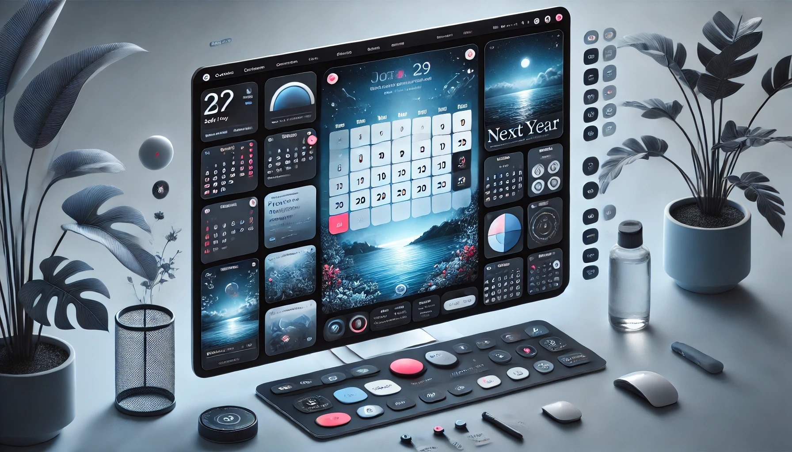

# 🗓️ Interactive Calendar: Your Ultimate Scheduling Companion

## 🧰 Built With

🧭 Overview

A fully responsive, theme-rich web calendar built with HTML, CSS, and JavaScript.
It offers 600+ themes, real-time weather updates, event management, and persistent local storage — no frameworks, no dependencies.

A minimalist yet powerful calendar built for focus, flow, and flexibility.

✨ Key Highlights

🎨 800+ Themes – From Ocean View to Cyber Pulse
📱 Fully Responsive – Works flawlessly across desktop, tablet & mobile
💾 Local Storage – Your data stays safe between sessions
♿ Accessibility-First – WCAG-compliant & keyboard-friendly
🌤️ Weather Integration – Real-time Celsius updates
⚡ Lightning Fast – No frameworks, pure performance

## 🚀 Live Demo

**🌍 Explore the Calendar:** [https://interactive-calendar-any-year.netlify.app/](https://interactive-calendar-any-year.netlify.app/)

🧩 Features Overview

📅 Core Calendar
Dynamic year navigation (⏪ / ⏩)
Click-to-add, edit, or clear events
Automatic “Today” highlight
Persistent data with LocalStorage

🎨 Personalization
600+ prebuilt themes + Dark/Light mode
Responsive transitions & theme memory

♿ Accessibility & UX
High-contrast, WCAG-compliant
Keyboard navigation (TAB-supported)
Screen reader friendly

⚙️ Enhanced Functionality
🕰️ Real-time analog clock
🌦️ Live weather (Celsius)
🔝 Back-to-top button
📱 Touch-optimized interface

## Basic Usage
1️⃣ Navigate years — Previous / Next buttons
2️⃣ Add or edit events — click any date
3️⃣ Switch themes — 600+ available options
4️⃣ Toggle dark/light mode
5️⃣ View real-time weather updates

## 🛠️ Quick Start

# Clone the repository
git clone https://github.com/SergeyReizman/Interactive-Calendar-Any-Year.git

# Navigate to project directory
cd Interactive-Calendar-Any-Year

# Open in browser
open index.html

Basic Usage
1.Navigate Years: Use the Previous/Next year buttons
2.Add Events: Click any date to add or edit events
3.Switch Themes: Use the theme selector for 600+ options
4.Toggle Dark Mode: Click the dark/light mode toggle
5.View Weather: Check today's weather for better planning

## 🗂️ Folder Structure

Interactive-Calendar-Any-Year/
├── 📁 css/
│   ├── 🎨 calendar.variables.css          # CSS Variables & Theme System
│   ├── 📌 calendar.core.css               # Core Layout & Components
│   ├── 📱 calendar.responsive.css          # Responsive Design
│   ├── 🏰 calendar.abandoned-castle.css   # Abandoned Castle Theme
│   ├── 🌊 calendar.adriatic-sea.css       # Adriatic Sea Theme
│   ├── 🌿 calendar.aloe-vera.css          # Aloe Vera Theme
│   └── ...800+ additional theme files
├── ⚡ calendar.js                         # Main Application Logic
├── 📄 index.html                          # Application Entry Point
├── 📸 screenshot.png                      # Project Screenshot
└── 📖 README.md                           # Project Documentation

🎨 Popular Themes
Category	Featured Themes
🌿 Nature	Ocean View, Alpine Landscape, Deep Forest
💻 Modern	Cyber Pulse, Silicon Valley, Dark Mode
❄️ Seasonal	Winter Wonderland, Tropical Sunset
🖤 Elegant	Black Velvet, Monochrome Ink, Pure Light
*Explore all 800+ themes in the live application!*

## ⚙️ Technical Details

💡 Technologies:
HTML5 • CSS3 (Flexbox & Grid) • JavaScript (ES6+) • LocalStorage API

✅ Browser Support: Chrome 60+, Firefox 55+, Safari 12+, Edge 79+
⚡ Lightweight: Zero dependencies

## 🧱 Performance

🚀 Fast loading & smooth animations
💾 Efficient event persistence
⚙️ Modular CSS architecture

## 🧭 Roadmap

🗓️ Monthly & Weekly Views
🎨 Custom Theme Builder
🔁 Recurring Events
📱 PWA Support
☁️ Calendar Sync (Google / Outlook)
🧩 Task Management Integration

## 🤝 Contributing

# 1. Fork the repo
# 2. Create your branch
git checkout -b feature/AmazingFeature
# 3. Commit changes
git commit -m "Add AmazingFeature"
# 4. Push & open a PR

## 📜 License
Licensed under the MIT License — see the LICENSE file for details.

## 💬 Final Note

😫 Overwhelmed by your schedule?
✨ Reclaim your time with Interactive Calendar — built for focus, flow, and flexibility.
“This isn’t just a calendar — it’s your time, your way.”

👨‍💻 Author & Links

👨‍💻 Built ❤️ by Sergey Reizman https://www.linkedin.com/in/sergey-reizman/
🌍 Live Demo https://interactive-calendar-any-year.netlify.app/
💾 Source Code https://github.com/SergeyReizman/Interactive-Calendar-Any-Year

🙋‍♂️ Support
Report Bugs: GitHub Issues
Request Features: Feature Requests
Live Demo: Netlify Deployment

🎯 Why Choose Interactive Calendar?

For Individuals

✅ Stay organized — never miss a date
✅ Reduce stress — clean & intuitive interface
✅ Personalize everything — 600+ themes
✅ Work anywhere — desktop to mobile

For Developers

✅ Clean, modular code
✅ Zero dependencies
✅ Accessibility-focused
✅ Easy to extend

💡 Purpose & Vision

To turn time management from chaos into clarity — empowering users to focus, plan, and achieve with ease.

Ready to transform your time management?

🚀 Try the Live Demo • 📖 View Source Code

Built ❤️ by Sergey Reizman

💡 Philosophy

“Simple tools, done exceptionally well.”

This project focuses on:

- clarity over complexity
- performance over frameworks
- user experience over bloat

😫 Feeling overwhelmed by your schedule?
✨ Reclaim your time with the Interactive Calendar!

💡 Simplify your life with a clean, modern web app — built for focus, flow, and flexibility.

🎯 Purpose & Vision
To turn time management from chaos into clarity.
Whether planning projects, setting goals, or just surviving the week — this calendar helps you stay organized and in control.

🌐 Key Features

🖥️ Works on desktop, tablet, and mobile
📝 Click-to-Add Events — fast, intuitive, visually clean
🧹 Clear with confidence — remove a single day or wipe the calendar
📅 Jump between years instantly
🔖 Highlight today — always know where you are
🔄 Keyboard navigation — scroll through months with TAB
💾 Local storage — data persists between sessions
🌗 Dark mode + theme picker — 600+ themes including “Ocean View”
♿ Accessibility-first — WCAG-compliant, high-contrast, keyboard-friendly
🕰️ Live analog clock — for old-school time lovers
🌦️ Weather-aware planning — today’s weather in Celsius
🔝 Back-to-top button — easy navigation

✅ Impact
Stay Organized.
Stay Present.
Stay You.

This isn’t just a calendar — it’s your time, your way.
And I’ve loved building every pixel of it.

🚀 Struggling to keep track of tasks, appointments, and deadlines?
The Interactive Calendar is designed to revolutionize your time management.
With its intuitive interface, cross-device accessibility, and stunning themes like
🌊 Ocean View (plus 100+ more themes!), staying organized has never been easier.

📌 Effortless Scheduling, Anytime, Anywhere
Whether you're managing work deadlines, personal events, or both,
this modern web application ensures you're always on top of your schedule—wherever you go.

🌟 Key Features

⏰ Analog Clock 🕰️
✔️ Real-time analog clock powered by JavaScript, HTML, and CSS.
✔️ Smoothly animated ⏳ second, minute, and hour hands for a polished look.
✔️ Responsive design ensures seamless display across all devices.
✔️ Automatically syncs with your system time upon loading.

📅 Dynamic Year Navigation 🔄
✔️ Easily switch between years with intuitive ⏪ Previous Year and ⏩ Next Year buttons.
✔️ The current year is 🔴 highlighted in red for quick reference.

🌤️ Current Day & Weather Display 🌡️
✔️ Current Date: Displays today's date in bold, larger fonts for quick reference.
✔️ Today's Weather: Shows real-time weather updates in Celsius (e.g., "Sunny, 24°C") in a stylish, easy-to-read format.
✔️ Perfect for planning your day with weather conditions in mind.

📱 Fully Responsive Design 📟
✔️ Works flawlessly on desktops 🖥️, tablets 📲, and mobile devices 📱.

📝 Effortless Event Management 🖊️
✔️ Add, edit, or view events with a single click on any date.
✔️ Clear events for a specific date or reset the entire calendar in seconds.

💾 Local Storage Integration 📁
✔️ Events are saved locally in your browser, ensuring they persist even after refreshing the page.

🌙 Dark Mode & Custom Themes 🎨
✔️ Toggle between 🌞 light and 🌙 dark modes for a personalized experience.
✔️ Your theme preference is saved across sessions.

♿ Accessibility-First Design ✅
✔️ WCAG-compliant styles and high-contrast visuals for optimal usability.

🔝 Back to Top Button ⬆️
✔️ Quickly return to the top of the calendar with a smooth, one-click scroll.

🚀 Why Choose the Interactive Calendar?

✅ Stay Organized: Manage your tasks, events, and reminders effortlessly.
✅ Seamless Navigation: Jump between years and dates with ease.
✅ Today’s Highlight: The current date is automatically highlighted for quick reference.
✅ Weather-Aware Planning: Stay informed about today's weather in Celsius to plan your day better.
✅ Stress-Free Scheduling: Designed to make your life simpler, not busier.

🎉 What’s New?

🕰️ Analog Clock: A sleek, real-time clock to keep you on track.
✍️ Enhanced Event Management: Adding and clearing events is now faster and more intuitive.
🌙 Dark Mode: A personalized viewing experience that adapts to your preferences.
🌤️ Weather Integration: Get real-time weather updates in Celsius directly on your calendar.

🔹 Say goodbye to calendar chaos and hello to a smarter, more organized you. Try the Interactive Calendar today! 📆✨

How It Works:
Current Date: The calendar automatically highlights today's date and displays it prominently at the top of the page.

Weather Display: The weather for today is fetched and displayed in Celsius alongside the date, helping you plan your activities better.

📖 How to Use:
1️⃣ Navigate Between Years: Use the Previous and Next buttons.
2️⃣ Add Events: Click on any date to add, edit, or view reminders.
3️⃣ Highlight Today: The current date is automatically highlighted.
4️⃣ Toggle Themes: Switch between themes (Light, Dark, Ocean View, or Grayscale).
5️⃣ Dark Mode: Toggle dark mode for comfortable nighttime viewing.
6️⃣ Event Clearing: Clear all events for a specific date or reset the calendar.
7️⃣ Event Persistence: Your events are saved in your browser and stay intact across sessions.
8️⃣ Today's Weather: Shows real-time weather updates in Celsius (e.g., "Sunny, 24°C") in a stylish, easy-to-read format.

Want to see it in action?

🌍 Explore the Calendar:
https://interactive-calendar-any-year.netlify.app/

🔗Dive into the Code:
https://github.com/SergeyReizman/Interactive-Calendar-Any-Year

## Preview

📸 Screenshots

*A snapshot of the Interactive Calendar in action.*

## Technologies Used

- **HTML5:** Structures the calendar layout and content.
- **CSS3:** Creates visually appealing and responsive styles.
- **JavaScript:** Enables dynamic calendar generation and user interaction.

📖 How to Use

1️⃣ Download the Application

Choose one of the following options:

Clone the repository using Git:

git clone https://github.com/SergeyReizman/Interactive-Calendar-Any-Year.git  
Download the ZIP file and extract it to your preferred directory.

2️⃣ Open in Browser
Navigate to the extracted folder and open the index.html file in your favorite browser.

3️⃣ Explore the Features

- **Year Navigation:** Use the Previous Year and Next Year buttons to view different years.
- **Adding Events:** Click on any date to add a custom event or reminder.
- **Editing Events:** Modify or update existing events by clicking on the same date.
- **Today's Highlight:** The current date is automatically distinguished for quick identification.
- **Clearing Events:** Remove all events for a specific date or reset the calendar entirely with ease.
- **Dark Mode:** Toggle dark mode for a night-friendly view, and your preference will be remembered between sessions.
- **🔝 Back to Top:** Use the Back to Top button to smoothly scroll back to the top of the calendar.
- **Event Modal Window** Manage your events with an easy-to-use modal window for adding, editing, and deleting events.
- **TAB Enhancement** Easy scroll months with the "TAB" button.

4️⃣ Event Persistence
Your events are stored in your browser's local storage and remain intact between sessions.

🌟 What’s Next?
Stay tuned for upcoming updates, including:

Monthly Navigation
Custom Themes
Enhanced Event Filtering

Enjoy using the Interactive Calendar to stay organized and productive! 🚀

📅 Themed Calendar Web App - Project Specification

📝 Project Overview
The Themed Calendar Web App is a fully customizable and visually appealing calendar application designed for web use. It offers a diverse selection of themes, a responsive design, and an intuitive interface to streamline scheduling and event management.

🎯 Objectives

Develop a fully functional web-based calendar.
Provide multiple themes for a personalized user experience.
Ensure responsiveness across various devices.
Implement a modular and maintainable CSS structure.

🌟 Features

🌈 Multiple Themes: Users can switch between a variety of pre-defined themes.
📱 Responsive Design: Adapts seamlessly to different screen sizes and devices.
📅 Event Management: Add, edit, and remove events effortlessly.
🌑 Dark/Light Mode Support: Includes distinct styles for light and dark modes.
🤬 Minimalist UI: A clean and intuitive interface for easy navigation.

🛠 Technologies Used

HTML5: Structuring the calendar interface.
CSS3: Styling, themes, and responsive design.
JavaScript: Handling calendar logic and interactivity.

⚙️ Setup Instructions

Clone the repository.

Open index.html in a web browser.

Modify the CSS files to customize themes.

🚀 Future Enhancements

🔐 User Authentication: Allow users to save and sync events.

↔️ Drag & Drop Functionality: Enhance event management with intuitive interactions.

🔗 API Integration: Sync events with Google Calendar or Outlook.

🧳 Local Storage for Events: Save and persist events even after a page refresh.

🎨 Custom Theme Creation: Allow users to define their own theme.

📅 Multiple Views (Day/Week/Month): Improve usability with different calendar views.

📱 Progressive Web App (PWA) Support: Enable offline use and installation as a web app.

🏁 Conclusion
The Themed Calendar Web App offers an aesthetically pleasing and highly functional experience, enabling users to manage their schedules efficiently with a variety of themes and a responsive design. Future updates will focus on enhanced interactivity, user personalization, and seamless event synchronization.

A clean, fast, fully customizable calendar designed for focus, flow, and flexibility.

💡 Why I built it:

I wanted something simple…
…but powerful enough to actually enjoy using every day.

Something that doesn’t get in your way —
but helps you stay organized, calm, and in control.

💡 Transform your scheduling experience today!
🌍 Try the Live Demo 

https://interactive-calendar-any-year.netlify.app/

💾 View Source on GitHub

https://github.com/SergeyReizman/Interactive-Calendar-Any-Year

❤️ Built by Sergey Reizman

https://www.linkedin.com/in/sergey-reizman/